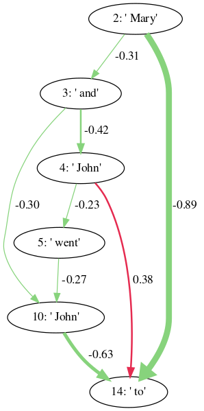

# LLM Connectome Explorer
This repository provides tools for exploring the information flow inside large language models. It contains functions for various interventions and strategies for creating information-flow diagrams. See the LW companion post [INSERT LINK HERE] for an in-depth explanation of the tool's purpose.



 You can find the code for reproducing the graphs from the post, as well as more experiments and examples of other interventions in the provided jupyter notebooks. 

 - `gpt2_ioi_experiments` compares various interventions for measuring the information flow through GPT2-small, as it processes an IOI prompt.
 - `attn_only_docstring_experiments` explores the 4-layer-attention-only transformer and [docstring completion task](https://www.lesswrong.com/posts/u6KXXmKFbXfWzoAXn/a-circuit-for-python-docstrings-in-a-4-layer-attention-only). It compares the different optimization strategies we implemented.
 - `pythia_long_prompt_experiments` shows how to use the splitting strategy to efficiently create information-flow diagrams for lng prompts and a large model such as Pythia-2.8B. 

# Setup

This project uses [Poetry](https://python-poetry.org/docs/) for dependency management. To get started simply create a shell while in the repository and install any depencies like this:
```
poetry shell
poetry install
```